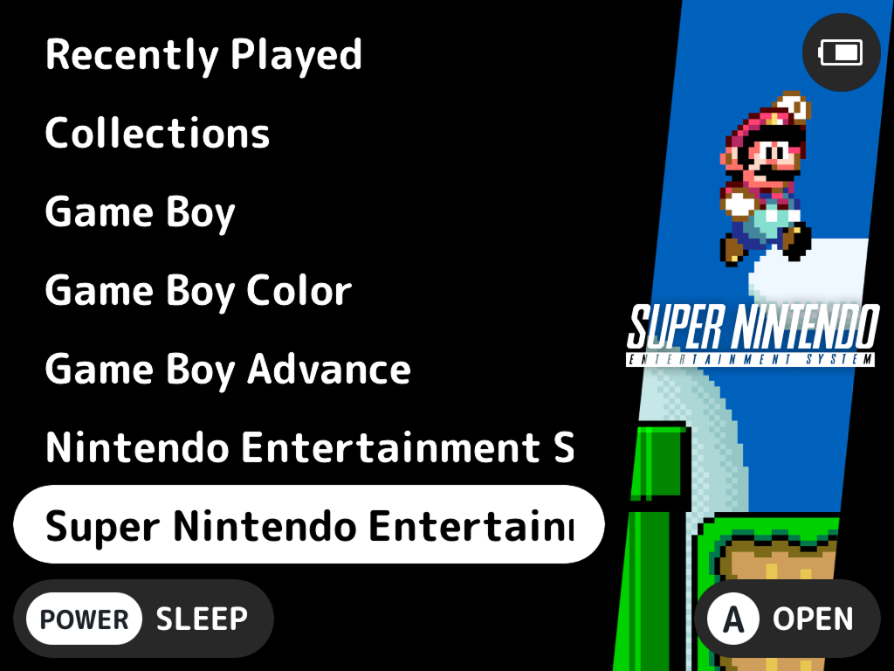

# Art Book NextUI Theme

## Supported Systems
- Amiga (AMIGA / PUAE)
- Arcade (FBN)
- Atari 2600 (ATARI)
- Atari 5200 (FIFTYTWOHUNDRED)
- Colecovision (COLECO)
- Commodore 64 (C64 / COMMODORE)
- DOS (DOS)
- Intellivision (INTELLIVISION)
- NeoGeo (NEOGEO)
- NeoGeo Pocket Color (NGPC)
- Nintendo 64 (N64)
- Nintendo DS (NDS)
- Nintendo Entertainment System (FC)
- Nintendo Game Boy (GB)
- Nintendo Game Boy Advance (GBA / MGBA)
- Nintendo Game Boy Color (GBC)
- Nintendo Game & Watch (GW)
- Nintendo Super Game Boy (SGB)
- Nintendo Super Nintendo Entertainment System (SFC / SUPA)
- Nintendo Virtual Boy (VB)
- PICO-8 (P8/ PICO)
- Playstation Portable (PSP)
- Pokemon Mini (PKM)
- Ports (PORTS)
- Sega Dreamcast (DC)
- Sega Game Gear (GG)
- Sega Genesis / Megadrive (MD)
- Sega Master System (SMS)
- Sony Playstation (PS)
- TurboGrafX-16 (PCE)
- WonderSwan Color (WSC)

## Process
1. Gather all required assets from the [Art Book Next ES-DE GitHub](https://github.com/anthonycaccese/art-book-next-es-de).
2. Create clear system icon.
3. Create a system background.
4. Create a system list background.
5. Create new system group. Give group a recognizable name containing the NextUI tag in parenthesis. If multiple tags are required use a forward slash and NOT a back slash.
6. System Background Tips
    - Logo width: No wider than 291 pixels. 
    - Use the "Logo Frame" as a guide to center the logo.
    - Add a drop shadow effect to the logo: X: 0, Y: 0, Spread: 16, Color: Black 50%
7. System List Background Tips
    - Logo width: No wider than 200 pixels.
    - Use the "Logo Frame" as a guide to center the logo.
8. Use other system frames as a guide for how to name the new system.
9. Set up exporting at 1x PNG for each frame.
10. With nothing in the board selected: File -> Export. All files should be automatically exported to the correct directory structure.

## Acknowledgments

- This theme is based on Art Book Next for ES-DE by Anthony Caccese and can be found on [GitHub](https://github.com/anthonycaccese/art-book-next-es-de).
- Most system logos were sourced and modified from the excellent work done by Dan Patrick here. I modified each to be compatible with EmulationStation's current SVG support.
- ChangaOne font is by Eduardo Tunni
- Oxygen font is by Vernon Adams
- Auto-Collection Genre background art created by @nautipuss
- Metadata Icons sourced from FontAwesome
- The Noir System Artwork set was created and provided by tenlevels with help from f8less and inspired by the artwork from the Epic Noir theme by chicuelo
- The Outline System Artwork set was created and provided by Joppa Fallston, inspired by denizonm's work.
- Some System Artwork was created and provided by theUnBurn
- Thank you to GenoCL for the idea of the multi-artwork system view. It got me to think about ES themes in a different way when building it out and it came out awesome.

## License

Creative Commons CC-BY-NC-SA - https://creativecommons.org/licenses/by-nc-sa/2.0/ You are free to share and adapt this theme as long as you provide attribution back to me (and the above credits) as well share any updates you make under the same licence terms.
